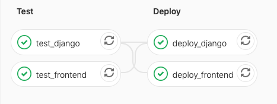

# WebApp

## Environment variables
```
DJANGO_DEBUG='true'
DATABASE_PASSWORD='password'
EMAIL_PASSWORD='password'
SERVER_PASSWORD='password'
```

## Tools and features

### Backend
- Django
- MySQL
- Celery
- Redis
- Sklearn
- Apache
- Ubuntu

### Frontend
- ReactJS

### Code quality
- Pep8
- ESLint
- Prettier

### CI/CD
- Gitlab CI/CD
- Netlify CI/CD
- Automated deploys


### AI
- A new model is trained every night based on historical transactions
- The new model is saved and deployed
- New transactions are automatically categorized by the AI

### Future development
- Use websockets instead of polling
- Switch to Typescript